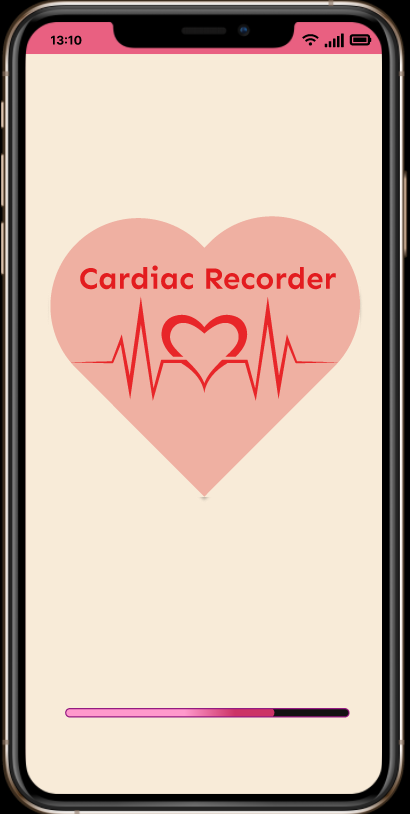
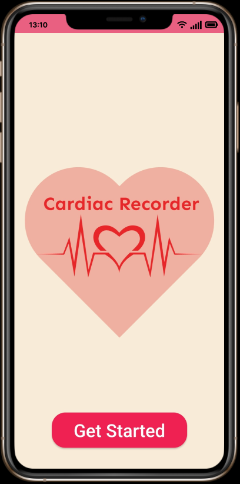
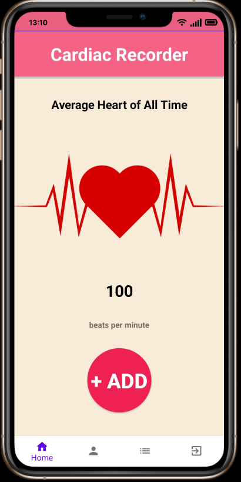
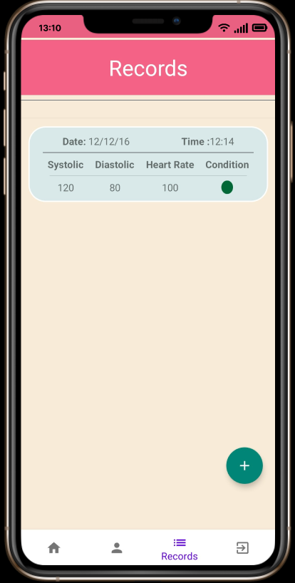
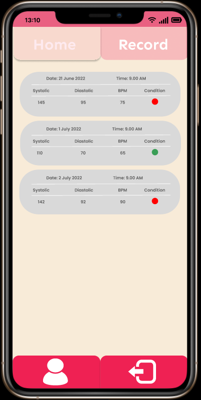
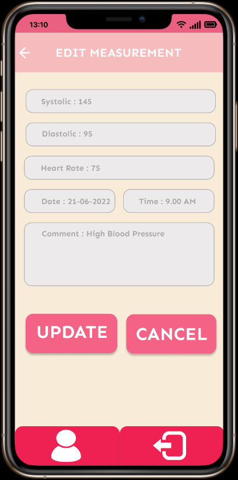
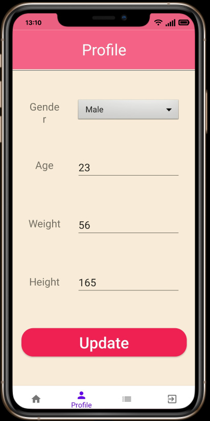

# CardiacRecorder
This is a simple, attractive, intuitive Blood Pressure Measurement App
It is very important to keep track of one's blood pressure and heart rate 
as it indicates ot one's health situation.To make it easy for users we have 
developed an app to keep track of their Blood pressure and Heart Rate data.
Based on Blood pressure and Heart rate an indicator flag is used to denote 
one's health condition.

Sample UI of the APP: 

 
 

 
 

 
 
